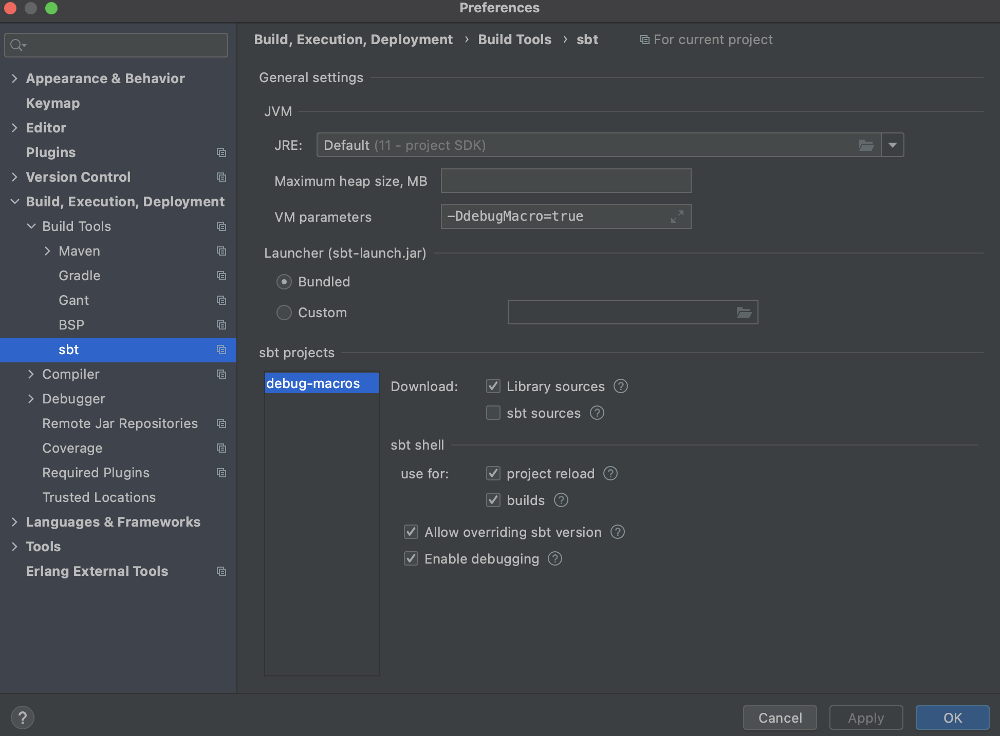

### Configuration Options

#### module
    macros consumer project: main
#### vm options 
    -Dscala.usejavacp=true
#### Main class 
    scala.tools.nsc.Main
#### Working directory
    path to repository directory: /Users/sagifogel/dev/debug-macros
####  Program arguments
   -cp {{macros consumer project class path}} {{macros consumer project path from repository}}:</br>
    ```
    -cp Main.scala main/src/main/scala/Main.scala    
    ```

### Sbt Settings
#### `IntelliJ` -> `Preferences` -> `Build, Execution, Deployment` -> Build tools -> sbt
#### VM Parameters 
      -DdebugMacro=true

